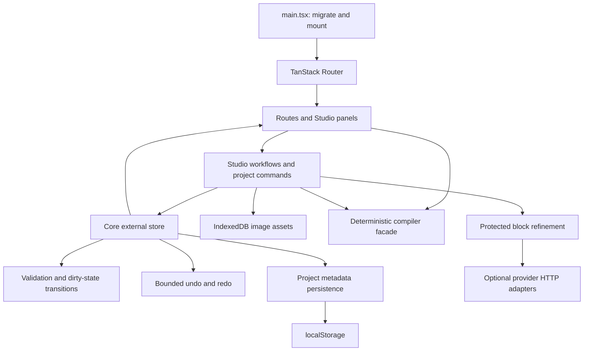

# Architecture

## Project overview

React renders a browser-only prompt workbench. TanStack Router retains file-based routes for Studio (/), Lab, Templates, History, Learning, Models, and Settings. Vite builds static files; no application server performs compilation or provider calls.

## Architecture map

## Runtime flow

1. Bootstrap migrates historical embedded image pixels before mounting the router. Migration failures retain original saved metadata and report a warning.
2. The store lazily loads a parsed saved project, an initial demonstration, or an empty project. Invalid saved project data is not deleted during loading.
3. Image upload creates original and preview blobs and adds metadata referencing an asset ID. The canvas stores normalized targets and movement coordinates through the store.
4. Every state transition computes dirty status, invalidates stale refinement, validates relationships, and calculates diagnostic scores. Undo/redo also passes through analysis. Autosave writes metadata according to settings.
5. The compiler derives five prompt formats, operation-dependent negatives, parameter bundles, and approximate token statistics. UI components never define a second role/operation policy table.
6. Shared workflows build blocks, save versions, copy outputs, import/export projects, and optionally call providers. Refinement checks input identity again before accepting a delayed result.

## Module boundaries

The stable compiler facade re-exports implementations for shared context, blocks, hashing, format rendering, negatives, bundles, and statistics. Extracted code retains its original wording and algorithms.

The project-store facade re-exports factories, commands, core store, and the React subscription hook. The core owns state publication; history owns bounded snapshots; persistence owns loading/saving/migration; transitions own analysis and dirty-state rules. Components subscribe via useSyncExternalStore.

Studio workflow services own side effects and notifications. Inspector panels render prompt output, controls, blocks, diagnostics, generation, and logs. The inspector hook owns transient display state. Copy-only drafts do not change ProjectState; edited technical blocks retain their existing locking behavior.

## Extension points

Add operations and roles through the canonical constants and types, then update compiler/validator behavior and compatibility tests intentionally. Add providers through providers.ts and mocked contract tests. Add routes through src/routes; Vite's router plugin regenerates routeTree.gen.ts. Do not hand-edit generated routes.

Keep Konva lazy-loaded. Keep bundled fonts and the current React/react-konva minor alignment. Optimize only after measuring a relevant bottleneck.
